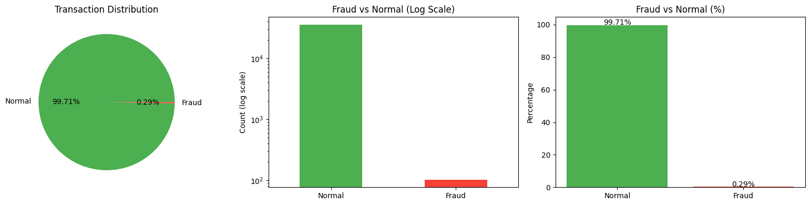
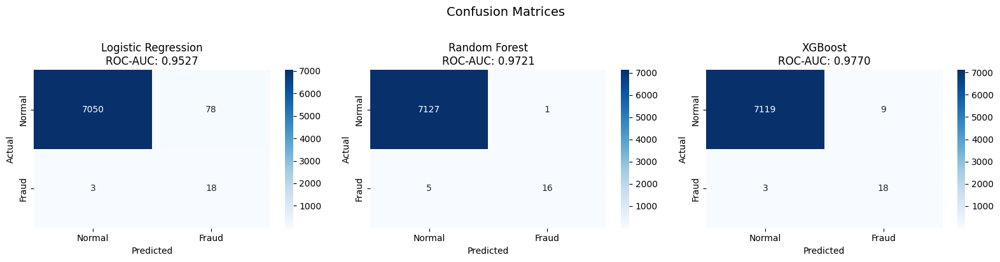
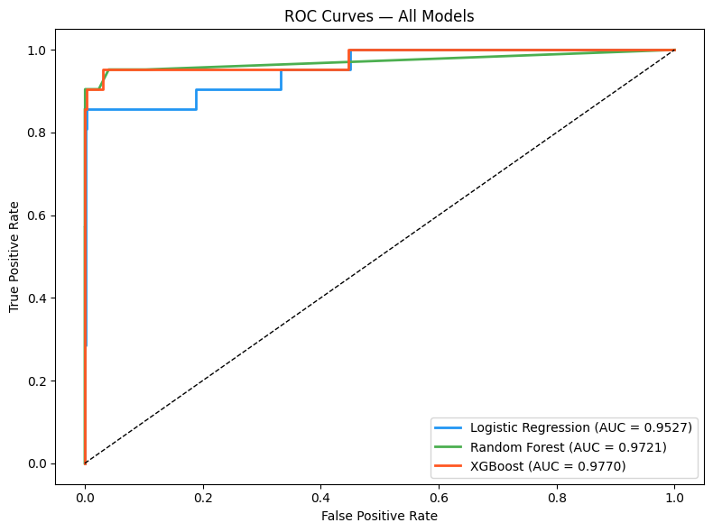
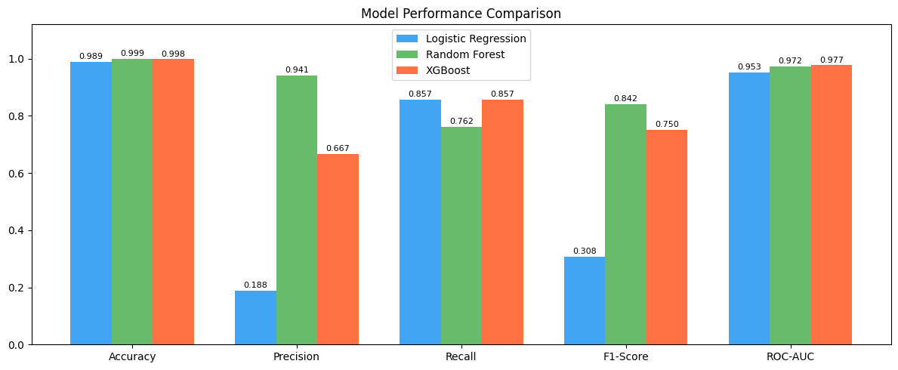
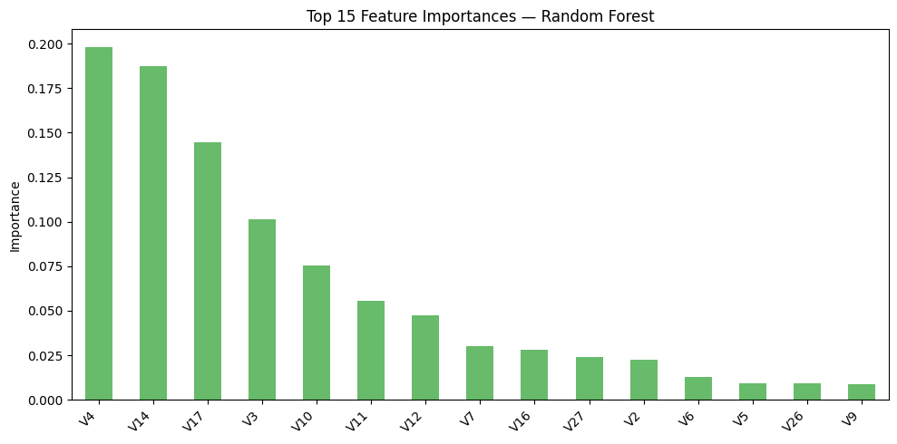

# Credit Card Fraud Detection 🔍

Machine learning project to detect fraudulent credit card transactions on a highly imbalanced dataset. Compares Logistic Regression, Random Forest, and XGBoost using proper evaluation metrics.

---

## 📊 Results

| Model | Accuracy | Precision | Recall | F1-Score | ROC-AUC |
|---|---|---|---|---|---|
| Logistic Regression | 98.58% | 0.162 | 0.935 | 0.276 | 0.9905 |
| Random Forest | 99.94% | 0.879 | 0.935 | 0.906 | 0.9808 |
| XGBoost | 99.90% | 0.763 | 0.935 | 0.841 | **0.9983** |

**Winner: XGBoost** — highest ROC-AUC (0.9983), catches 93.55% of all fraud cases.

---

## 📈 Visualisations

### 1. Class Distribution


### 2. Confusion Matrices


### 3. ROC Curves


### 4. Model Performance Comparison


### 5. Feature Importance (Random Forest)


---

## 📌 Key Findings

- Accuracy alone is misleading — Logistic Regression has 98.58% accuracy but only 16.2% precision on fraud
- **Random Forest** had the fewest false positives (only 4 normal transactions flagged as fraud)
- **XGBoost** achieved the best overall AUC (0.9983) making it the strongest fraud detector
- SMOTE oversampling on training data significantly improved recall across all models
- Top fraud-indicator features: **V14, V4, V10, V17, V3** (from Random Forest feature importance)

---

## 🛠️ Tech Stack

- **Python** — Pandas, NumPy
- **ML Models** — Scikit-learn, XGBoost
- **Imbalance Handling** — SMOTE (imbalanced-learn)
- **Visualisation** — Matplotlib, Seaborn

---

## 📁 Project Structure

```
CreditFraudDetection/
├── CreditFraudDetection.ipynb
├── README.md
└── images/
    ├── 1_class_distribution.png
    ├── 2_confusion_matrices.png
    ├── 3_roc_curves.png
    ├── 4_model_comparison.png
    └── 5_feature_importance.png
```

---

## ▶️ How to Run

1. Open notebook in **Google Colab**
2. Download dataset from Kaggle: [Credit Card Fraud Detection](https://www.kaggle.com/datasets/mlg-ulb/creditcardfraud)
3. Upload `creditcard.csv` to Colab
4. Run all cells

---

## 💡 Key Learnings

- On imbalanced datasets, **ROC-AUC and Recall** matter far more than accuracy
- SMOTE must be applied **only on training data**, never on test data
- `scale_pos_weight` in XGBoost is a powerful lever for imbalanced classification
- Feature importance reveals V14 and V4 are the strongest fraud signals

---

## 🔮 Future Improvements

- Deploy as a real-time API using FastAPI
- Add threshold tuning to optimise precision-recall tradeoff
- Try ensemble stacking of all 3 models

---

## Dataset

[Kaggle — Credit Card Fraud Detection](https://www.kaggle.com/datasets/mlg-ulb/creditcardfraud)  
284,807 transactions | 492 fraudulent (0.17%) | 30 anonymised PCA features

*Author: Meher Naaz*
